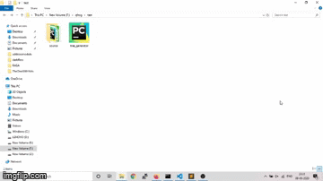
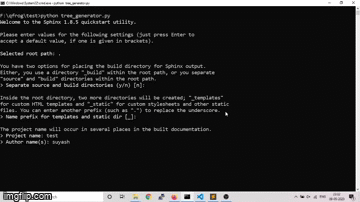
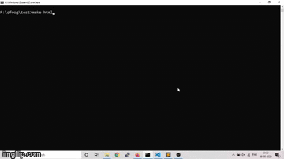

# AutoDocGenerator
This package generates mapping between functions making a block diagram of function calls and generates documentation using Sphinx.

## Dependencies

* BlockDiag
* Sphinx

installation of can be done using pip:
```bash
pip install blockdiag
pip install sphinx
```
## Steps to follow

* put tree_generator.py in the folder where you want to generate sphinx documentation.

  _NOTE_: __init__ file must be present in same folder in order to get full flow of the code.

  <p></p>

* run tree_generator.py and fill details in sphinx-quickstart if separate build and source folder doesn't exist already there.

  _NOTE_: always generate source and build folder separately which is first question asked in start of program.

  ```bash
  python tree_generator.py
  ```

  <p></p>

* Code will run and generate a separate ReStructure Template(rst) file for each function and a page with full code flow.

* Code directly read documentation from docstring provided it is just under the function defination.

  _NOTE_: always write docstring in between <b>'''(triple single quotes)</b> and not in between <b>"""(triple double quotes)</b>.
      Use <b>"""(triple double quotes)</b> for other purpose but <b>'''(triple single quotes)</b> are strictly reserved for docstring.

* NO need to change any comment or code if quote problem occurs. Just change file associated with function name from Source/<function_name>.rst .

  <p></p>

* run make.bat file 
  ```bash
  make html
  ```
